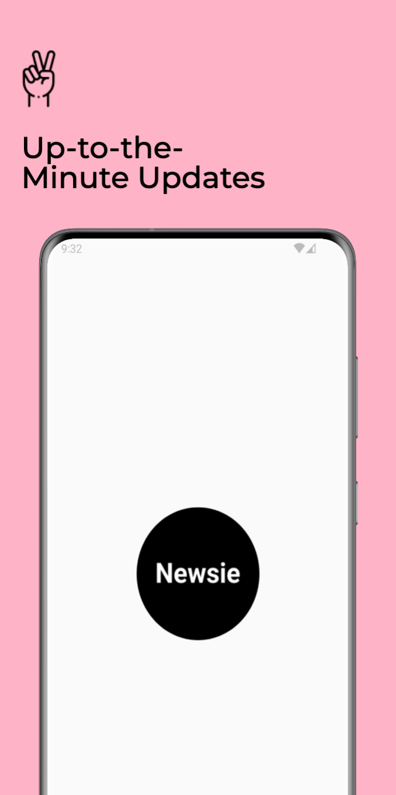

Introduction
============

Newsie is Simple app to read up to date news on your hands.

How To Run
----------

- Create file config.properties in your root project
- Initialize the secret key into your gradle file

Screenshot
==========
  